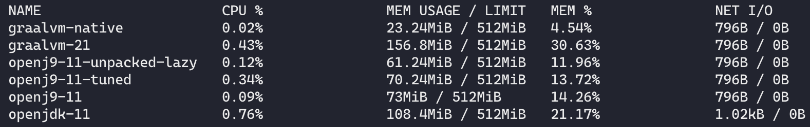
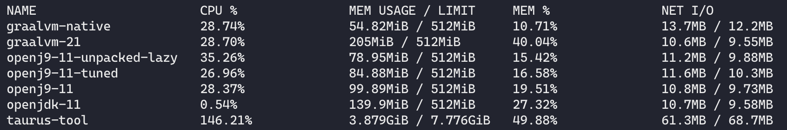

# Java Docker Images

Repository to test different Docker images.

Project structure:

* *hello-app*: Spring Boot app with simple REST controller.
* *images*: printscreens.
* *taurus*: scenarios script to run Taurus stress test.
* *ab-test*: script to run a monitored Apache Bench test against a local process.

## Build the App

First build the app with: `sh build_app.sh`.

Test the app: `curl http://localhost:8080/greetings`

## Build the Docker images

Images:

* OpenJDK
  * `docker build -t wesleyegberto/hello-app:minimal -f Dockerfile.openjdk_11 .`
* Open J9
  * `docker build -t wesleyegberto/hello-app:minimal -f Dockerfile.openj9_11 .`
* Open J9 Tuned (with CDS)
  * `docker build -t wesleyegberto/hello-app:minimal -f Dockerfile.openj9_11_tuned .`
* Open J9 Tuned (with CDS, unpacked JAR and lazy inicialization)
  * `docker build -t wesleyegberto/hello-app:minimal -f Dockerfile.openj9_11_unpacked_lazy .`
* GraalVM 20
  * `docker build -t wesleyegberto/hello-app:minimal -f Dockerfile.graalvm_20 .`
* GraalVM 21 - Native
  * `docker build -t wesleyegberto/hello-app:minimal -f Dockerfile.graalvm_native .`

## Stressing and Stats

Run any of the built Java images binding the port 8080.

Then run stress test with ApacheBench: `sh run_stress_with_ab.sh`

Monitoring docker stats: `docker stats`

Here is a sample from stats output after some minutes of idle (on my machine :p).

Under stressing:

### Taurus

Run all containers: `build_and_run_all.sh`

Run Blazemeter container with Taurus tool: `sh run_stress_with_taurus.sh`

## TODO

* [x] Spring Boot splitting the lib and classes
* [x] Spring Boot Native build
* [x] Spring Boot native with GraalVM
* [ ] Fabric8 run-java.sh
* [ ] Zulu VM docker image

## Links

* [Spring Boot & JVM blog post](https://medium.com/@jean_sossmeier/spring-boot-jvm-1eea422be930)
* [Chris Newland's blog](https://www.chriswhocodes.com/)
* [GraalVM Native Image Tips & Tricks](https://jamesward.com/2020/05/07/graalvm-native-image-tips-tricks/)
