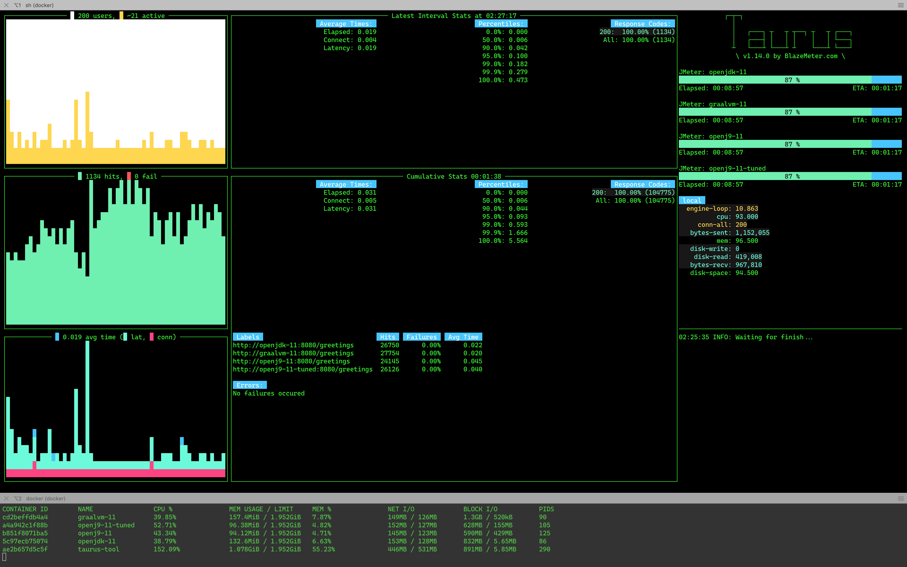

# Java Docker Images

Repository to test different Docker images.

Project structure:

* *hello-app*: Spring Boot app with simple REST controller.
* *images*: printscreens.
* *taurus*: scenarios script to run Taurus stress test.
* *ab-test*: script to run a monitored Apache Bench test against a local process.

## Build the App

First build the app with: `sh build_app.sh`.

Test the app: `curl http://localhost:8080/greetings`

## Build the Docker images

Images:

* OpenJDK
  * `docker build -t wesleyegberto/hello-app:minimal -f Dockerfile.openjdk_11 .`
* Open J9
  * `docker build -t wesleyegberto/hello-app:minimal -f Dockerfile.openj9_11 .`
* Open J9 Tuned (with CDS)
  * `docker build -t wesleyegberto/hello-app:minimal -f Dockerfile.openj9_11_tuned .`
* GraalVM 19
  * `docker build -t wesleyegberto/hello-app:minimal -f Dockerfile.graalvm_19_11 .`
* GraalVM 20
  * `docker build -t wesleyegberto/hello-app:minimal -f Dockerfile.graalvm_20_11 .`

## Stressing and Stats

Run any of the built Java images binding the port 8080.

Then run stress test with ApacheBench: `sh run_stress_with_ab.sh`

Monitoring docker stats: `docker stats`

Here is a sample from stats output after some minutes of idle (on my machine :p).

```sh
CONTAINER ID        NAME                CPU %               MEM USAGE / LIMIT     MEM %               NET I/O             BLOCK I/O           PIDS
d383deca2050        graalvm_11          0.38%               346.6MiB / 1.952GiB   17.34%              928B / 0B           4.06MB / 0B         36
89b83e2583ea        openj9_11_tuned     0.07%               81.95MiB / 1.952GiB   4.10%               928B / 0B           0B / 94.4MB         38
a739331b6d2a        openj9_11           0.15%               93.84MiB / 1.952GiB   4.69%               1.02kB / 0B         987kB / 4.1kB       39
94d1a178c2b2        openjdk_11          0.64%               187.7MiB / 1.952GiB   9.39%               1.11kB / 0B         1.56MB / 0B         37
```

### Taurus

Run all containers: `build_and_run_all.sh`

Run Blazemeter container with Taurus tool: `sh run_stress_with_taurus.sh`

[](./images/taurus-printscreen.png)

## TODO

* [ ] Spring Boot splitting the lib and classes
* [ ] Spring Boot native build
* [ ] Spring Boot native with GraalVM
* [ ] Fabric8 run-java.sh

## Links

* [Spring Boot & JVM blog post](https://medium.com/@jean_sossmeier/spring-boot-jvm-1eea422be930)
* [Chris Newland's blog](https://www.chriswhocodes.com/)
